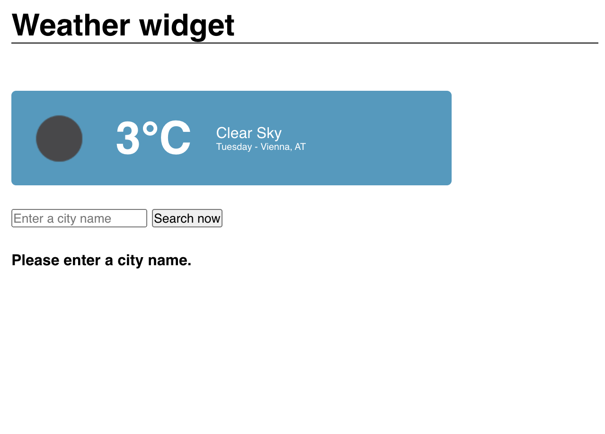
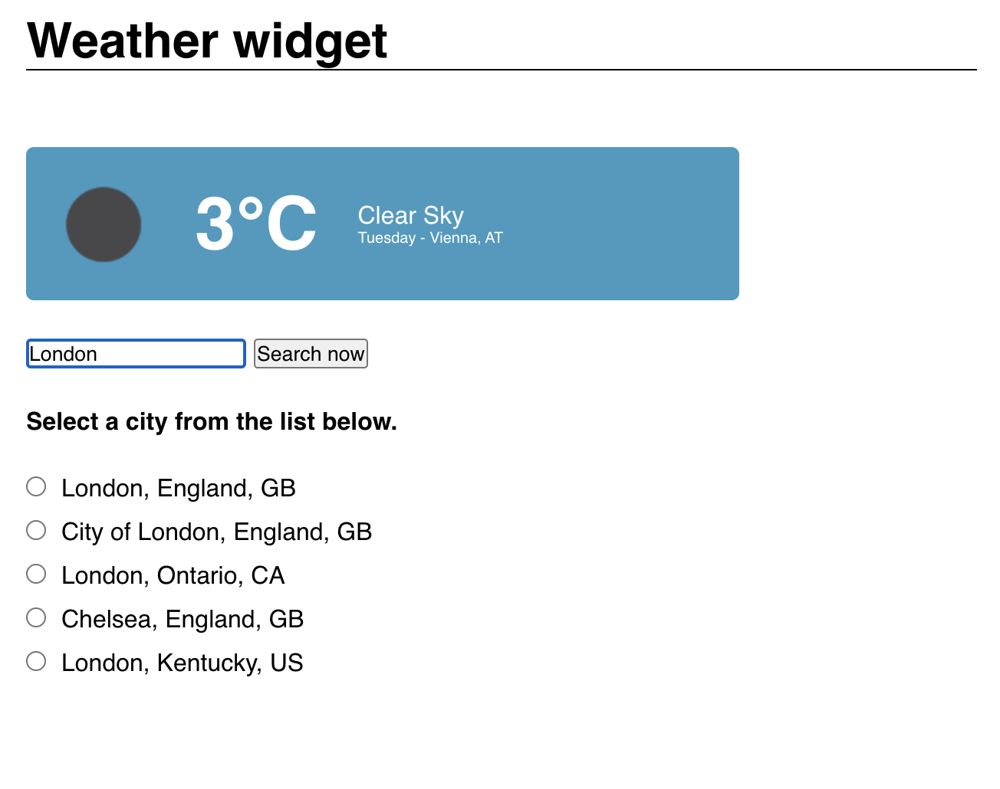

# Simple react weather widget.

This react weather widget was created as part of the UpLeveled GmbH coding boot camp. You can open the deployed app here: https://main--profound-liger-606627.netlify.app/

<table>
  <tr>
    <td></td>
    <td></td>
  </tr>
</table>

## Core features

- The widget uses the openweathermap.org API to fetch weather data.
- Upon page load, Vienna's current weather will be fetched by default.
- The weather information includes
  - Location (city and country)
  - Degrees in celsius.
  - Icon representing the current weather situation.
  - Description of the current weather situation.
  - The current day of the week (not taken from the API).

## Additional features

- The location can be changed via the text input field.
- API request is sent only on button click / "enter" key down to improve performance.
- Conditional rendering (if nothing was searched and if there's no result) is used to improve the UX.
- The list of result is limited to 10 entries.
- Upon selecting any result, the weather fetching is triggered using the LatLong of the selected city.

## Additional notes

- API key is set as env variable to avoid revealing it.
- Env variable was configured on Netlify to make it work.
- Using the widget on codesandbox won't work as env variable wasn't configured there.
